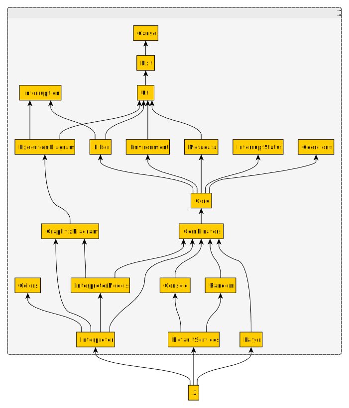

# Module dependencies

Lean has a strict linear dependency order, which includes definitions within the same file and imports between files.

The module `Z` is declared in `lakefile.lean` as 

```
lean_lib Z
```

The entry point for the module is the file `zenith/Z.lean` (bottom box in the diagram).

This file will import files in the directory `zenith/Z/` , and create other definitions as well.

Imports are transitive, so that doing a simple `import Z` in a file will bring all the (top level) definitions and namespaces in the tree into scope.

