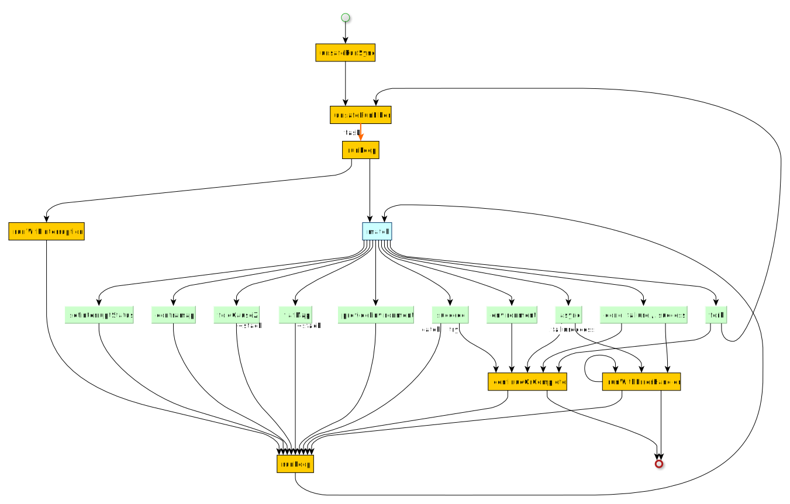

# Interpreter

The function `Z.unsafeRunSync` is the entry point for the interpreter.




`Z.unsafeRunSync` will launch a new thread to run the current effect and wait until execution completes, so it is meant to be used only once per Zenith program.

The interpreter is defined in several mutually recursive, partial functions:

* `unsafeRunFiber`
  Launches new fibers on the background
* `runLoop`
  Main interpreter
* `runWithErrorHandler`
  Error handler
* `continueOrComplete`
* `runWithInterruption`

The interpreter uses a stack to hold both `next` / `errorHandler` continuations coming from `foldCauseZ` and `flatMap`.

```coq
inductive Stack: Type -> Type -> Type -> Type -> Type 1 where
  | more
      (next          : A -> Z R E₁ A₁) 
      (errorHandler? : Option (Cause E -> Z R E₁ A₁))
      (eq_E_E₁?      : Option (PLift (E = E₁)) := none)
      (tail          : Stack E₁ A₁ E₂ A₂)
      (parentId      : Option NodeId)
      (validEnv      : R ∣ Rfiber)
      (env           : Environment Rfiber)
    : Stack E A E₁ A₁

  | done (complete: Observer E A) : Stack E A Empty Empty
```

Execution finishes when the callback `complete` in `Stack.done` evaluated.

The stack and other bookkeeping information is captured in a structure `RunState`:

```coq
structure RunState (Rfiber) (E A E₁ A₁: Type) where
  interruption : Interruption
  fiberInfos   : IO.Ref (List FiberInfo)
  stack        : Stack E A E₁ A₁
  environment  : Environment Rfiber
  fiberId      : FiberId
  initialTime  : Nat
```

Every fiber has a `RunState`  is associated with a single fiber (via `FiberId`).


